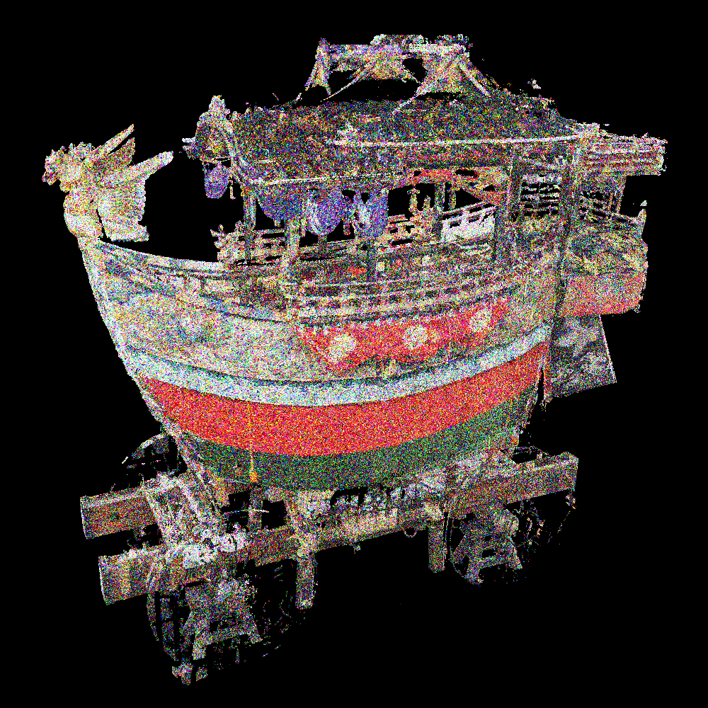

# Add_Noise_to_Point_Cloud
## Overview
- Add noise to point cloud

- We have the following "hree types of noises"
   - Gaussian
   - Poisson
   - Spike

- We have the following two "noise targets"
   - Coordinate
   - Color

## Result
### Coordinate Noise
#### Gaussian noise

#### Poisson noise

#### Spike noise

### Color Noise
#### Original color

#### Noise color (sigma=5)

#### Noise color (sigma=10)

