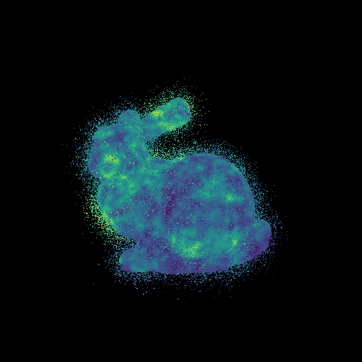
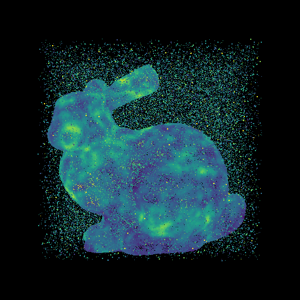
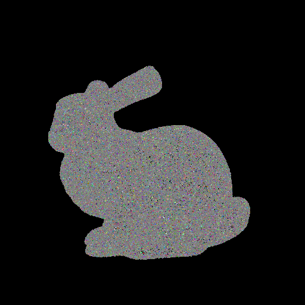

# Add Noise to Point Cloud

## Example
```
$ sh config.sh
$ make
$ make install
$ make test_coords_gaussian
$ make test_coords_outlier
$ make test_color_gaussian
```
## Coords noise

### Overview
- Add the following two types of noises to the coordinates of the point cloud:
   - Gaussian noise
   - Outlier noise

### Usage
```
=============================================
     Add Noise to "Coords" of Point Cloud
               Tomomasa Uchida
                 2021/02/06
=============================================

  USAGE:
  ./addNoise2coords [input_file] [output_file] [noise_probability] [sigma] [noise_type]

  EXAMPLE:
  ./addNoise2coords input.ply output.spbr 0.1 0.02 -g

   [noise_probability]
    Add noise with 10(=0.1*100) percent.

   [sigma]
    Gaussian: sigma = 0.02
    Outlier : none(skip the sigma.)

   [noise_type]
    -g: Gaussian noise
    -o: Outlier noise
```

## Visualization Results
|Gaussian noise|Outlier noise|
|:-:|:-:|
|||


<br>

## Color noise

### Overview
- Add the gaussian noise to the color of the point cloud.

### Usage
```
============================================
     Add Noise to "Color" of Point Cloud
              Tomomasa Uchida
                2021/02/06
============================================

  USAGE:
  addNoise2color [input_file] [output_file] [noise_probability] [sigma]

  EXAMPLE:
  addNoise2color input.ply output.spbr 0.2 40

   [noise_probability]
    Add noise with 20(=0.2*100) percent.

   [sigma]
    Gaussian: sigma = 40
```

## Visualization Results
|Gaussian noise|
|:-:|
||