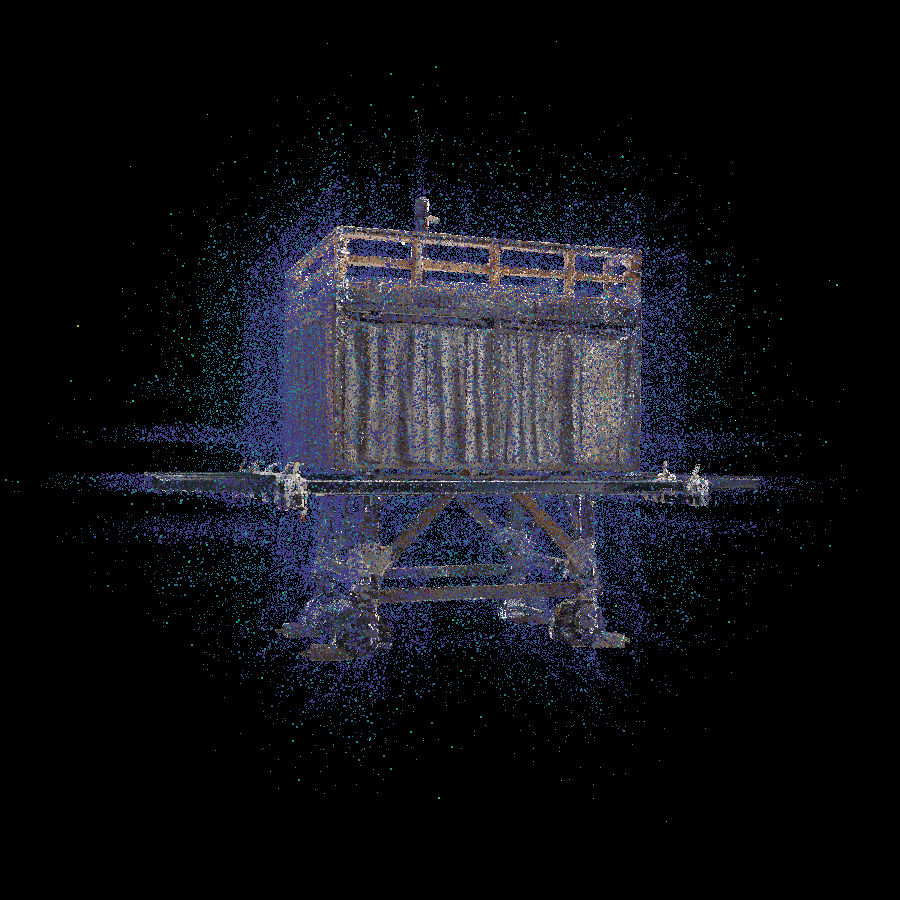

# Add_Noise_v001
## Overview
Add the following three types of noises to point cloud
- Gaussian
- Poisson
- Spike

## Usage
`./addNoise [input_file] [output_file] [ratio_of_adding_noise] [param_spec_to_noise] [noise_option]`

## For example
`./addNoise [.ply] [.spbr] [0.1] [0.01] [-g]`

argv[1] : Input file (.ply)

argv[2] : Output file (.spbr)

argv[3] : Ratio of adding noise

argv[4] : Parameter specific to noise (sigma, lamda)

argv[5] : Noise type

### 1. Gaussian
  - argv[3] : 0.1
    - Add noise with 10 percent. (0.1*100)

  - argv[4] : 0.01
    - sigma2 = 0.01

  - argv[5] : -g
    - AddNoise::Gaussian

  

### 2. Poisson
  - argv[3] : 0.1
    - Add noise with 10 percent. (0.1*100)

  - argv[4] : 0.01
    - lamda = BoundingBox_length * 0.01

  - argv[5] : -p
    - AddNoise::Poisson

### 3. Spike
  - argv[3] : 0.1
    - Add noise with 10 percent. (0.1*100)

  - argv[4] : 0.01
    - none.

  - argv[5] : -s
    - AddNoise::Spike

