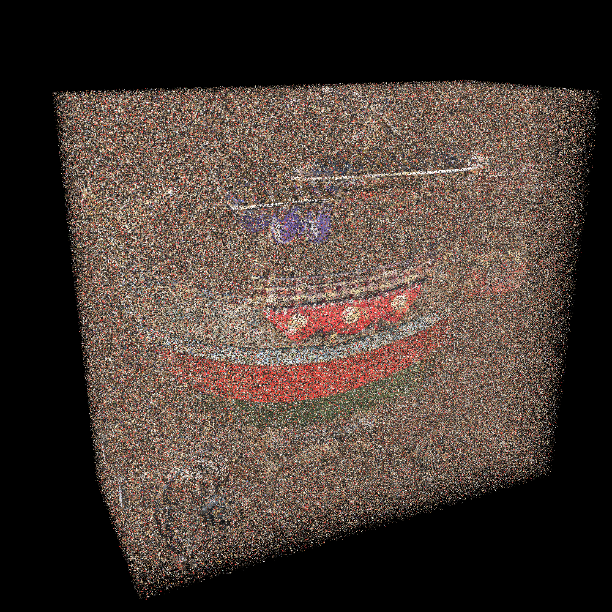
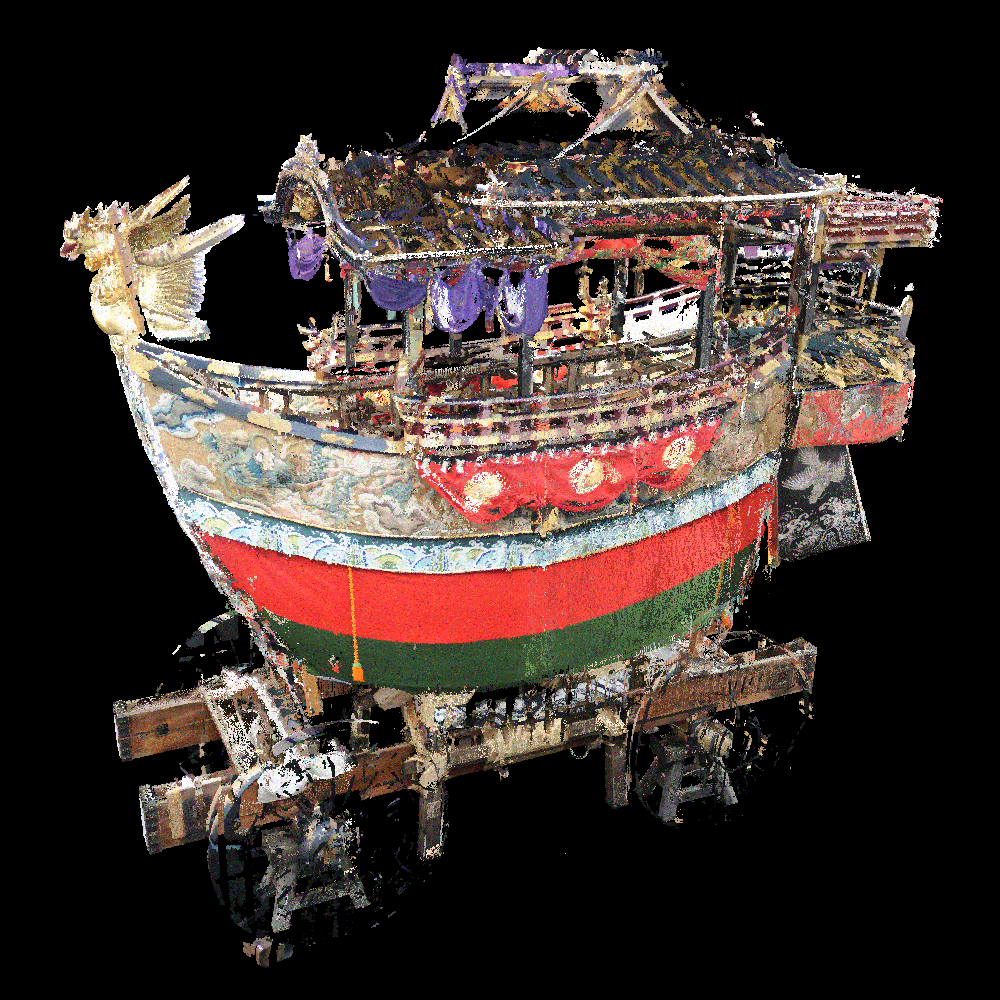

# Add_Noise_to_Point_Cloud
## Overview
- Add noise to point cloud

- We have the following two types of "noise targets"
   - Coordinates
      - Gaussian noise
      - Outlier noise
   - Color
      - Gaussian

## Visualization Results
### Noise in "coordinate" space
|Gaussian noise|Outlier noise|
|:-:|:-:|
|||

### Noise in "color" space
|Original color|sigma=20|sigma=40|
|:-:|:-:|:-:|
||||