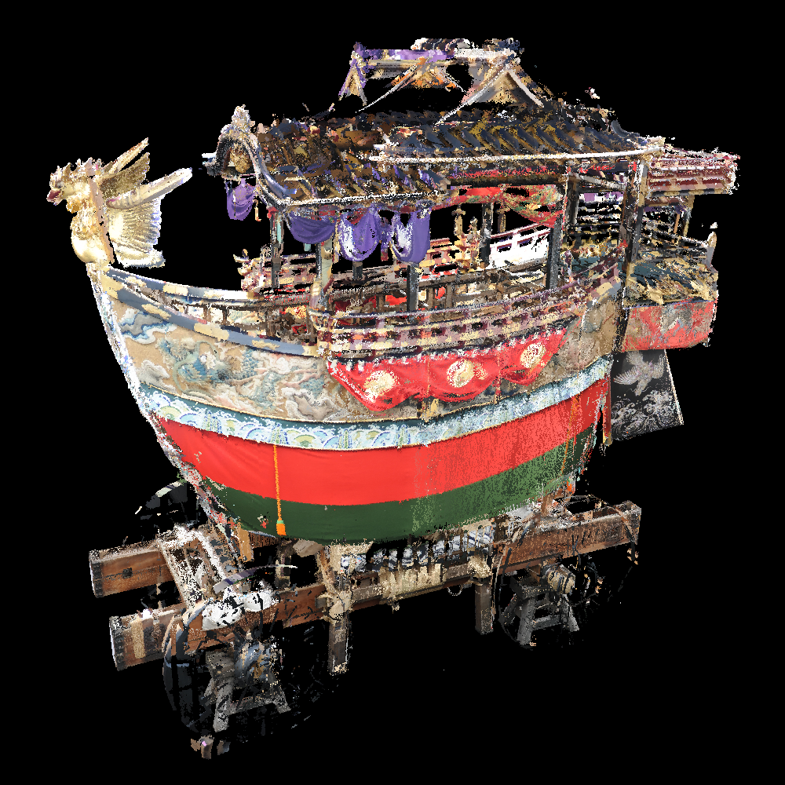
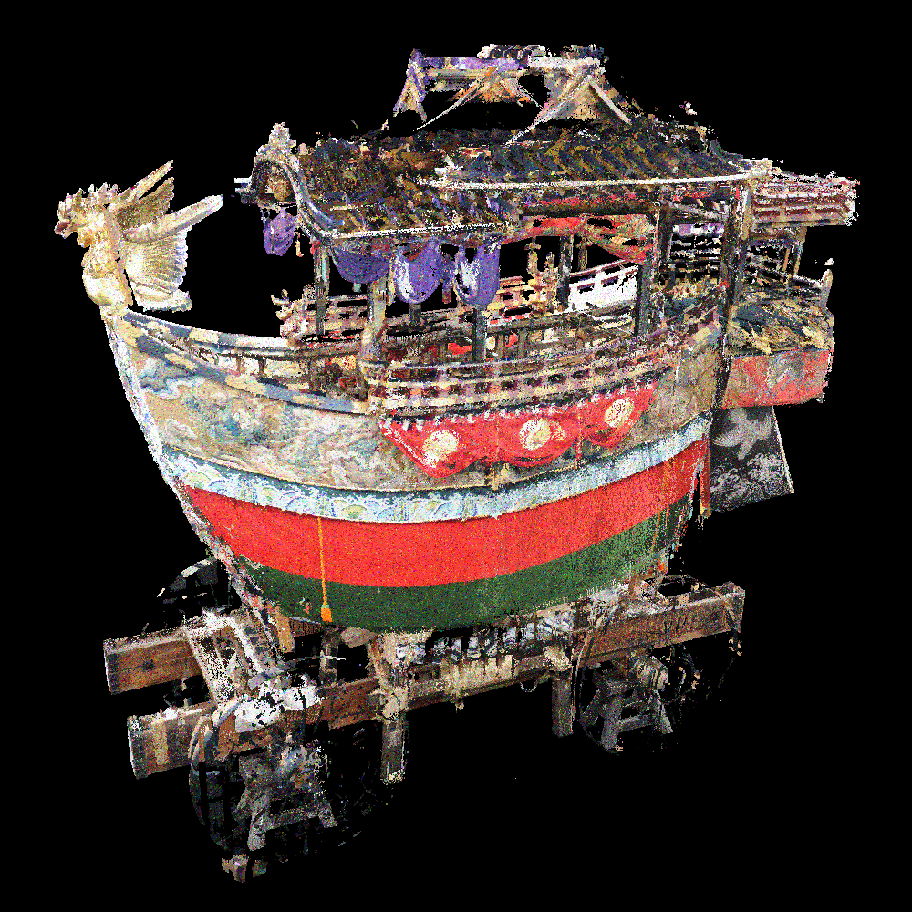

# Add Noise to "Color" of Point Cloud
## Overview
- Add the Gaussian noise to the color of each point.

## Usage
```
$ ./addNoise2color 

=============================================
     Add Noise to "Color" of Point Cloud
              Tomomasa Uchida
               2020/06/21
=============================================

  USAGE:
  ./addNoise2color [input_file] [output_file] [noise_probability] [sigma(=standard deviation)]

  EXAMPLE:
  ./addNoise2color input.ply output.spbr 0.1 5.0
```

## Visualization Result
|Original color|sigma=20|sigma=40|
|:-:|:-:|:-:|
||||