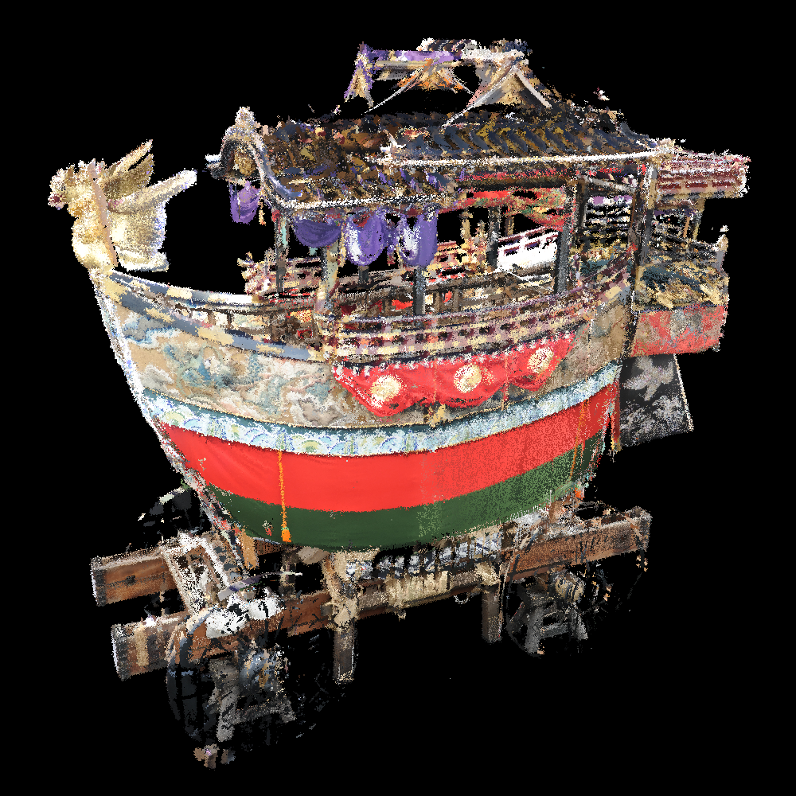

# Add Noise to "Coords" of Point Cloud
## Overview
- Add the following three types of noises to the coordinates of each 3D point.
   - Gaussian noise
   - Outlier noise

## Usage
```
$ ./addNoise2coords 

================================================
     Add Noise to "Coords" of Point Cloud
               Tomomasa Uchida
                 2020/06/21
================================================

  USAGE:
  ./addNoise2coords [input_file] [output_file] [noise_probability] [hyperparameter4noise] [noise_type]

  EXAMPLE:
  ./addNoise2coords input.ply output.spbr 0.1 0.1 -g

   [noise_probability]
    Add noise with 10(=0.1*100) percent.

   [hyperparameter4noise]
    Gaussian: sigma = 0.1
    Outlier : none

   [noise_type]
    -g: Gaussian noise
    -o: Outlier noise
```

## Visualization Result

|Gaussian noise|Outlier noise|
|:-:|:-:|
|||