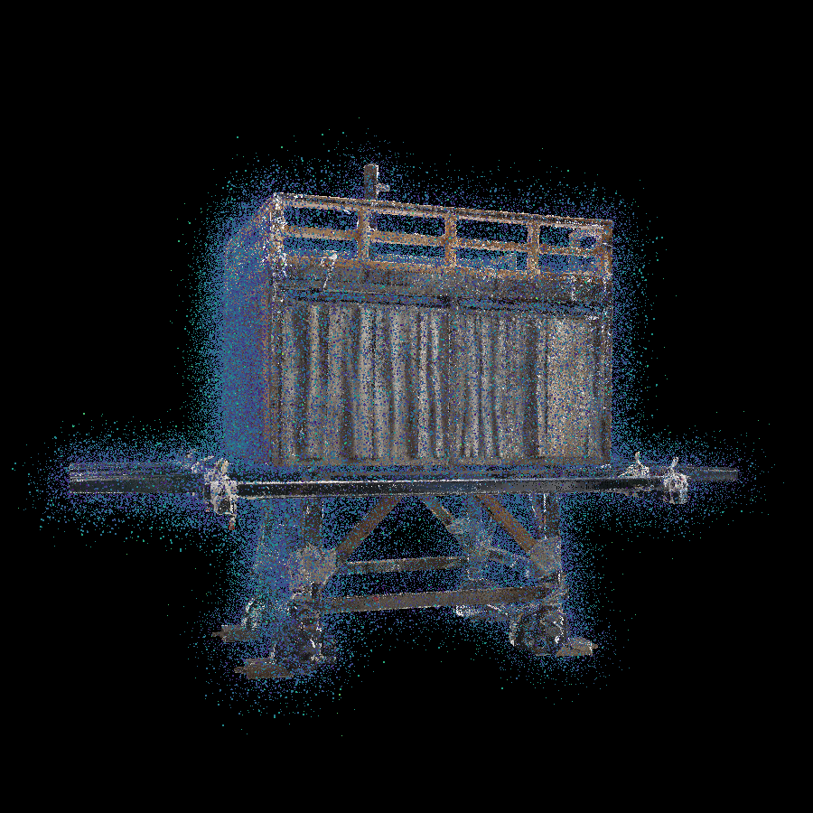

# Add_Noise_to_Point_Cloud
## Overview
Add the following three types of noises to point cloud
   - Gaussian
   - Poisson
   - Spike

### Usage
`./addNoise [input_file] [output_file] [ratio_of_adding_noise] [param_spec_to_noise] [noise_option]`

### For example
`./addNoise [.ply] [.spbr] [0.1] [0.01] [-g]`

argv[1] : Input file (.ply)

argv[2] : Output file (.spbr)

argv[3] : Ratio of adding noise

argv[4] : Parameter specific to noise (sigma, lamda)

argv[5] : Noise type

### Result
#### Parameter
|Noise type|argv[3]|argv[4]|argv[5]|
|:--|:-:|:-:|:-:|:-:|
|Gaussian|0.1(10%)|0.01(variance=0.01)|-g|
|Poisson|0.1(10%)|0.01(lamda=BoundingBox_length * 0.01)|-p|
|Spike|0.1(10%)|none|-s|

#### Figure
|Gaussian|Poisson|Spike|
|:-:|:-:|:-:|
||||